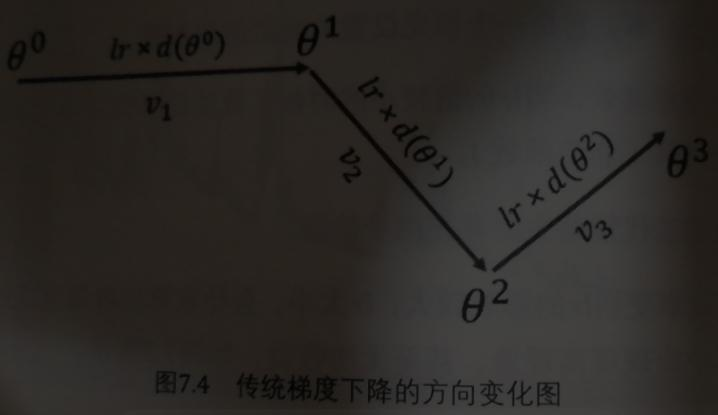
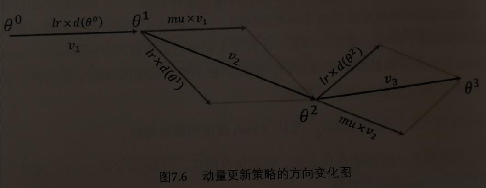
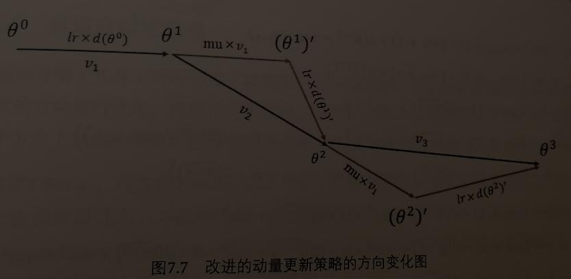
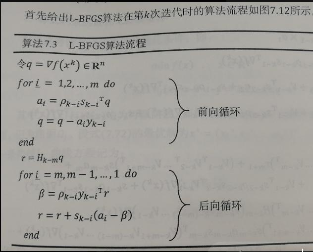

## TITLE
## CLUE
## CONTENT
### 简介
上实际中期形成和发展起来的一门应用数学分支科学。
机器学习的模型训练，最终都归结为最优化问题，也就是寻找最优的参数，使得模型的误差损失函数最小，而寻找最优参数的方法称为最优化方法。
### 无约束极小值的最优化条件
定理：局部极小值点必有梯度等于零。

利用机制的必要条件，把求解函数极小值问题，转化为求解下面的方程组问题：
$$\nabla{f(\boldsymbol{x})}=0$$
但是一般不会用解析法来求解上式而是使用数值计算最常用的最优化方法迭代法。它的基本思想是：首先给定$f(\boldsymbol{x})$的一个极小值点的初始估计$x^{0}$，然后通过迭代的方法得到点序列$\{x^t\}(t=1,2,...)$，如果这个点序列的极限$x^*$逼近极小值点，那么称这个序列为极小化序列，因此，最优化问题转化为应该如何得到这个极小化的点序列？

在欧几里得空间中，点$x^{k+1}$和点$x^{k+1}$之差是一个向量，写成：
$$x^{k+1}=x^{k}+\lambda\boldsymbol{d}_k$$
$\lambda$为学习率，$\boldsymbol{d}_k$为一个迭代方向。好的迭代算法必须满足两个条件：第一，递减行，第二，收敛性。
### 梯度下降算法
梯度下降算法是神经网络最常用的优化方法之一。
#### 梯度下降算法的分类
根据每一次迭代所使用的训练数据集范围的不同，可以分为：
##### 批量梯度下降(BGD)
也称为最速下降法，误差损失函数由全量训练数据的误差构成。
###### 缺点
- 当数据量很大时，速度会非常慢。
- 它不能以在线的方式更新模型，即当训练数据有新的元素加入时，需要对全量的数据进行更新，因此效率很低。
- 因此一般不被采用。
##### 随机梯度下降(SGD)
每次更新只考虑一个样本数据的误差损失，故其优点就是速度远快于BGD，且能进行在线的参数更新。
###### 缺点
- 由于单个样本会出现相似或重复的情况，因此数据的参数更新会出现冗余。
- 单个数据之间的差异会比较大，造成每一次迭代的损失函数会出现较大的波动。

图1.1

##### 小批量梯度下降(MBGD)
结合了BGD和SGD的优点，并且克服了它们的缺点，每次的参数更新，优化的目标函数是由$n$个样本数据构成，而$n$一般很小，一般取$10$到$500$之间。
###### 优点
- 效率跟SGD差别不大。
- 与SGD相比，MBGD每一批考虑了更多的样本数据，每一批数据之间的整体差异更小、更平均，结果也更稳定。
- 与SGD一样适用于在线的模型更新。
#### 传统更新策略
亦被称为**vanilla策略**，梯度下降算法中最简单的参数更新策略。
$$\theta=\theta-lr×d\theta$$
##### 优点
简单高效，学习率较小时，能够保证得到全局最优解（凸函数）或者局部最优解（非凸函数）。
##### 缺点
- 学习率太小，算法收敛速度过慢；学习率过大，在迭代过程中容易出现震荡现象，甚至无法收敛。
- 在较为平坦的平面区域，由于梯度接近于0，因此每一次迭代的变化非常小，造成训练效率下降，甚至被误判为最优解而提前终止。

图1.1

#### 动量更新策略
传统的梯度更新策略，每一次迭代的方向$d_k$等于当前的batch数据集的误差损失函数的梯度，但是，很多时候不同的batch之间数据变化比较大，这样就会造成迭代方向来回震荡的情况，从而减缓了收敛的速度，甚至导致发散。

动量更新策略，更新时在一定程度上保留之前等新的方向的同时，也利用当前batch的梯度微调最终的更新方向，因此，整个更新策略及保留了稳定性，也能根据实际的数据变化做出相应的调整。
$$v_i=mu×v_{i-1}+lr×d(\theta^{i-1})\\
\theta^i=\theta^{i-1}-v_i$$
第一部分是上一时刻的迭代方向，即动量或惯性，记为$mu×v_{i-1}$，$v_{i-1}$为上意识可的迭代方向，$mu$是动量系数。
第二部分是当前batch样本集合的梯度方向，记为$lr×d(\theta^{i-1})$。
当上一次迭代方向与当前batch的梯度方向相反时，动量更新策略能起到一个减速作用，防止走偏；相反，如果相同，则起到一个加速的作用，**避免在平坦的曲面上迭代过慢**。

图1.2

#### 改进的动量更新策略
$$(\theta^{i-1})'=\theta^{i-1}-mu×v_{i-1}\\
v_i=mu×v_{i-1}+lr×d((\theta^{i-1})')\\
\theta^i=\theta^{i-1}-v_i$$
这种被称为"向前看"策略效率更高。

图1.3

#### 自适应梯度策略
前面的策略都是针对迭代的方向进行优化，而步长是固定的，即所有的参数共享相同的学习率，学习率在没一个方向上的大小固定，这样很容易造成算法被卡在鞍点的位置(saddle point)。
而AdaGrad是一种自适应的调整学习率的方法其每一次迭代的公式：
$$acc_i=acc_{i-1}+(d(\theta_{i-1}))^2\tag{1}$$
$$\theta_i=\theta_{i-1}-\frac{lr}{\sqrt{acc_i+\epsilon}}×d(\theta_{i-1})\tag{2}$$
其中，$lr$是全局学习率，$\epsilon$是一个非常小的正数，防止分母为零。
迭代的方向由梯度方向$d(\theta_{i-1})$来决定，但学习率不再固定。
- 由式子(1.1)知，当迭代时间越长，累加的梯度$acc$越大，使得式子(1.2)的学习率会随着时间减少，在接近目标函数的最小值时不会因为学习率过大而走过头。
- 不同的参数之间学习率不同，因此，与前面的固定学习率算法相比，不容易卡在鞍点。
- AdaGrad特别适合于**稀疏参数网络**的最优化求解，因为对于系数权重参数，不太重要的参数(0值或接近于0值的参数)，其倒数累加之和会比较小，我们可以放心打步伐前进，相反，……
#### 其他梯度下降策略
Adadelta、RMSprop、Adam等。其中前两者在递归神经网络中的表现要远远优于SGD。
### 共轭梯度
好像对于深度神经网络没有什么用处……
### 牛顿法
牛顿迭代公式：
$$\boldsymbol{x}^{k+1}=\boldsymbol{x}^{k}-\left(\nabla^2f(\boldsymbol{x}^k)\right)^{-1}\nabla{f(\boldsymbol{x}^k)}$$
### 拟牛顿法
#### 拟牛顿条件
用一个矩阵$\boldsymbol{H}_k$来近似第$k$次迭代时的海森矩阵逆矩阵$\left(\nabla^3f(\boldsymbol{x}^k)\right)^{-1}$，从而拟牛顿迭代公式：
$$\boldsymbol{d_k}=\boldsymbol{H}_k\nabla{f(\boldsymbol{x}^k)}\\
\boldsymbol{x}^{k+1}=\boldsymbol{x}^{k}-a_k\boldsymbol{d_k}\tag{3}$$
拟牛顿条件（或者称为secant等式）：
$$\boldsymbol{y}_k\approx\boldsymbol{B}_{k+1}×\boldsymbol{s}_k$$
或者
$$\boldsymbol{s}_k\approx\boldsymbol{H}_{k+1}×\boldsymbol{y}_k$$
其中
$$\boldsymbol{s}_k=\boldsymbol{x}^{k+1}-\boldsymbol{x}^{k}$$
$$\boldsymbol{y}_k=\boldsymbol{g}_{k+1}-\boldsymbol{g}_{k}$$
$$\boldsymbol{H}_{k+1}\approx\left(\nabla^2f(\boldsymbol{x}^{k+1})\right)^{-1}$$
$$\boldsymbol{B}_{k+1}=(\boldsymbol{H}_{k+1})^{-1}\approx\nabla^2f(\boldsymbol{x}^{k+1})$$
它定义了
$\boldsymbol{B}_{k}$对海森矩阵$\nabla^2f(\boldsymbol{x}^{k+1})$进行模拟约束，以及$\boldsymbol{H}_k$对海森矩阵的逆$\left(\nabla^2f(\boldsymbol{x}^{k+1})\right)^{-1}$进行模拟约束。
#### DFP算法
$$\boldsymbol{H_{k+1}}=\boldsymbol{H_{k}}+\frac{\boldsymbol{s}_k\boldsymbol{s}_k^T}{\boldsymbol{s}_k^T\boldsymbol{y}_k}-\frac{\boldsymbol{H}_k\boldsymbol{y}_k\boldsymbol{y}_k^T\boldsymbol{H}_k}{\boldsymbol{y}_k^T\boldsymbol{H}_k\boldsymbol{y}_k}$$
#### BFGS算法
$$\boldsymbol{B_{k+1}}=\boldsymbol{B_{k}}+\frac{\boldsymbol{y}_k\boldsymbol{y}_k^T}{\boldsymbol{y}_k^T\boldsymbol{s}_k}-\frac{\boldsymbol{B}_k\boldsymbol{s}_k\boldsymbol{s}_k^T\boldsymbol{B}_k}{\boldsymbol{s}_k^T\boldsymbol{B}_k\boldsymbol{s}_k}$$
即
$$\boldsymbol{H}_{k+1}=\left(\boldsymbol{I}-\frac{\boldsymbol{s}_k\boldsymbol{y}_k^T}{\boldsymbol{y}_k^T\boldsymbol{s}_k}\right)\boldsymbol{H}_{k}\left(\boldsymbol{I}-\frac{\boldsymbol{y}_k\boldsymbol{s}_k^T}{\boldsymbol{y}_k^T\boldsymbol{s}_k}\right)+\frac{\boldsymbol{s}_k\boldsymbol{s}_k^T}{\boldsymbol{y}_k^T\boldsymbol{s}_k}$$
#### L-BFGS算法
BFGS算法最大的问题就是每一步都要保存$\boldsymbol{H}$，而L-BFGS使用$(\boldsymbol{s}_{k-m+1},\boldsymbol{s}_{k-m+2},...,\boldsymbol{y}_k)^T$和$(\boldsymbol{y}_{k-m+1},\boldsymbol{y}_{k-m+2},...,\boldsymbol{y}_k)^T$来模拟牛顿方向$\boldsymbol{H}_k\boldsymbol\nabla{f(x^k)}$。
l-bfgs算法流程
<button onclick="javascript:var a=document.getElementById('img0');if(a.style.width=='0px'){a.style.width='100%';this.innerText='隐藏';}else{a.style.width='0px';this.innerText='展开';}window.scrollTo(0,this.offsetTop)" style="background:#080;color:#fff;font-weight:bold;border-radius:10px;border:none;cursor:pointer;outline:none;overflow:auto">展开</button>
</img>
当后向循环完成后，得到的$r_1$就是当前第$k$次迭代的牛顿方向。其中
$$\rho_k=\frac{1}{\boldsymbol{y}_k^T\boldsymbol{s}_k}$$
$$\boldsymbol{V}_k=\boldsymbol{I}-\rho_k\boldsymbol{y}_k\boldsymbol{s}_k^T$$
## SUMMARY
